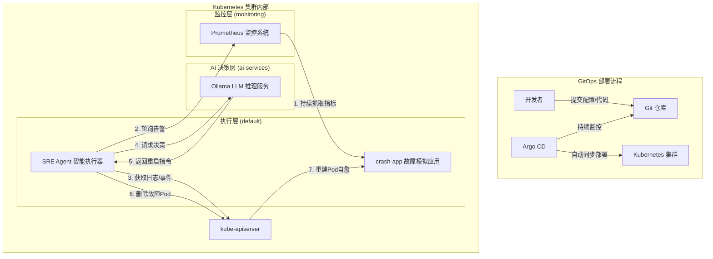

K8s SRE智能运维助手

一个基于云原生架构的 AI 智能运维助手，实现自主闭环运维，自动完成 “发现问题 -> 分析问题 -> 解决问题” 的完整流程

项目介绍

K8s SRE 智能运维助手是一个反应式（Reactive）的 AI 智能体，核心设计思想是自主闭环运维，即在无人干预的情况下，自动完成 “发现问题 -> 分析问题 -> 解决问题” 的完整流程。它可以作为初级 SRE 工程师，24 小时不间断地巡检系统，并在预设的故障场景下进行自动化处理。

核心特性

- 🚀 自主闭环运维：自动完成 “发现问题 -> 分析问题 -> 解决问题” 的完整流程，无需人工干预

- 🔍 智能感知监控：基于 Prometheus 实现系统指标监控与告警

- 🧠 AI 决策大脑：集成 Ollama LLM 实现智能决策与行动建议

- 🛠️ 云原生架构：基于 Kubernetes 构建，具备高可用、可扩展特性

- 📦 GitOps 管理：通过 Argo CD 实现声明式部署与配置管理

- 🔄 自动化故障处理：针对 Pod 崩溃常见故障实现自动重启修复

技术栈

核心技术

- Kubernetes (K8s)：容器编排与运行平台

- Prometheus：监控与告警系统

- Ollama：本地 LLM 推理服务，提供智能决策能力

- Go 语言：SRE Agent 核心开发语言

- Ansible：基础设施自动化部署

- Argo CD：GitOps 持续部署工具

- Helm：Kubernetes 应用包管理

- Docker/Containerd：容器化与镜像管理

架构图

环境要求

- 3 台 Linux 服务器（1 个 Master 节点，2 个 Worker 节点）

- CentOS/RHEL 8+ 操作系统

- 4GB 以上内存，2 核以上 CPU

- 网络互通，SSH 可访问

---
⭐️ 如果本项目对你有帮助，欢迎点个 Star 支持！
